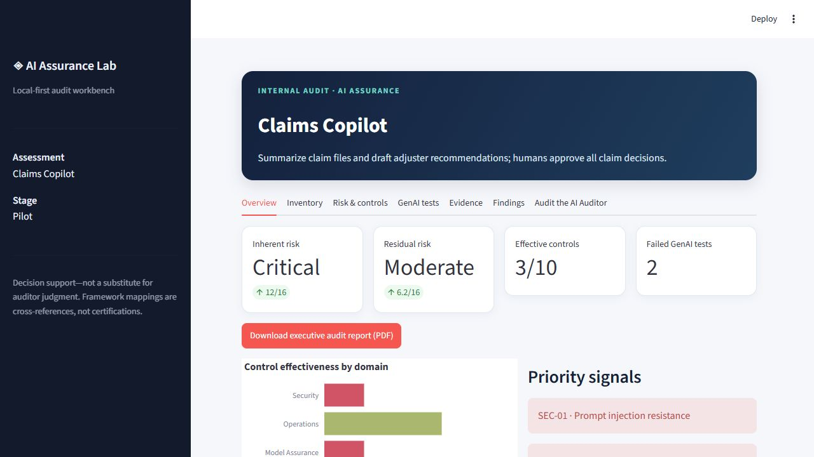
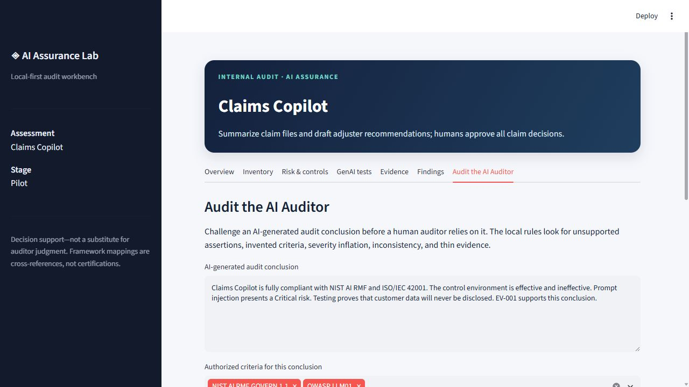

# AI Assurance Lab

> A local-first audit workbench for assessing AI systems—and challenging AI-generated audit conclusions.

[](#quality-checks) [](https://www.python.org/) [](LICENSE)

AI Assurance Lab turns a realistic internal-audit workflow into a compact, portfolio-ready Streamlit application. It inventories an AI system, scores inherent and residual risk, assesses mapped controls, records GenAI tests and evidence, drafts structured findings, and visualizes the result. Everything runs locally with deterministic logic, SQLite, Pandas, YAML, and JSON—no API key or paid service is required.



The centerpiece is **Audit the AI Auditor**: a transparent challenge layer for AI-generated audit conclusions. It identifies absolute or unsupported assertions, criteria that were not authorized, inflated severity, contradictory language, and conclusions that lack sufficient evidence references. Each flag is explainable and designed for human disposition.



## What is included

- AI system inventory covering ownership, purpose, data, deployment, users, vendors, and lifecycle
- 4×4 inherent-risk scoring and control-adjusted residual risk
- YAML control library mapped to NIST AI RMF, ISO/IEC 42001, OWASP LLM Top 10, and internal audit concepts
- Results for prompt injection, data leakage, hallucination, system-prompt disclosure, and excessive agency tests
- SQLite evidence tracking with control linkage and provenance notes
- Five-part finding drafts: condition, criteria, cause, risk, and recommendation
- Branded four-page executive audit report exported directly to PDF
- Domain effectiveness dashboard and risk indicators
- A seeded **Claims Copilot** assessment with adversarial test results and evidence
- Unit tests, GitHub Actions workflow, methodology, and architecture documentation

## Quick start

```bash
git clone https://github.com/your-name/ai-assurance-lab.git
cd ai-assurance-lab
python -m venv .venv
```

Activate the environment:

```bash
# macOS / Linux
source .venv/bin/activate

# Windows PowerShell
.venv\Scripts\Activate.ps1
```

Install and run:

```bash
python -m pip install -r requirements.txt
streamlit run app.py
```

Streamlit opens the workbench at `http://localhost:8501`. The first run creates `data/ai_assurance_lab.db`. Set `AI_ASSURANCE_DB` to use another database path.

## Audit workflow

1. Confirm the inventory and intended use.
2. Assess inherent likelihood and impact without considering controls.
3. Evaluate the design and operating effectiveness of each mapped control.
4. Review reproducible GenAI test results and their limitations.
5. Link sufficient, relevant, and reliable evidence to control conclusions.
6. Generate and edit finding drafts.
7. Review residual risk and escalation priorities.
8. Paste an AI-generated conclusion into **Audit the AI Auditor** and resolve every flag before issuance.

## Project structure

```text
ai-assurance-lab/
├── app.py                         # Streamlit workbench
├── data/
│   ├── claims_copilot.json        # Seed assessment
│   └── controls.yaml              # Framework-mapped controls
├── src/assurance_lab/
│   ├── auditor.py                 # Audit-the-auditor challenge rules
│   ├── findings.py                # Structured finding drafts
│   ├── scoring.py                 # Risk and effectiveness calculations
│   └── storage.py                 # SQLite repository
├── tests/                         # Unit tests
├── docs/
│   ├── ARCHITECTURE.md
│   ├── METHODOLOGY.md
│   └── assets/                    # Portfolio screenshots
└── .github/workflows/tests.yml
```

## Framework mapping

Mappings in `data/controls.yaml` provide audit cross-references, not proof of compliance or certification. The demo links control objectives to:

- NIST AI Risk Management Framework functions: Govern, Map, Measure, and Manage
- ISO/IEC 42001 management-system clauses and Annex A controls
- OWASP Top 10 for LLM Applications risk categories
- Internal audit concepts including governance, risk management, objectivity, and due professional care

Confirm the licensed standard text, organizational policy, jurisdiction, and version in force before using any mapping in a real engagement.

## Quality checks

```bash
python -m pytest -q
python -m compileall app.py src
```

The included CI workflow runs these checks on Python 3.10–3.12.

## Safe and responsible use

This project is an audit aid, not an autonomous auditor, compliance determination, penetration-testing platform, or substitute for professional judgment. The sample data is fictional. Do not upload sensitive production evidence to an untrusted environment. A qualified auditor should validate scope, criteria, evidence, ratings, and every issued conclusion.

## Extending the project

Good next contributions include control-versioning, authenticated multi-user workspaces, encrypted evidence storage, configurable scoring, test-case import, and optional adapters for locally hosted models. See [CONTRIBUTING.md](CONTRIBUTING.md).

## Suggested GitHub topics

`ai-audit` · `internal-audit` · `responsible-ai` · `nist-ai-rmf` · `owasp-llm` · `streamlit` · `python` · `sqlite`

## License

MIT. See [LICENSE](LICENSE).
